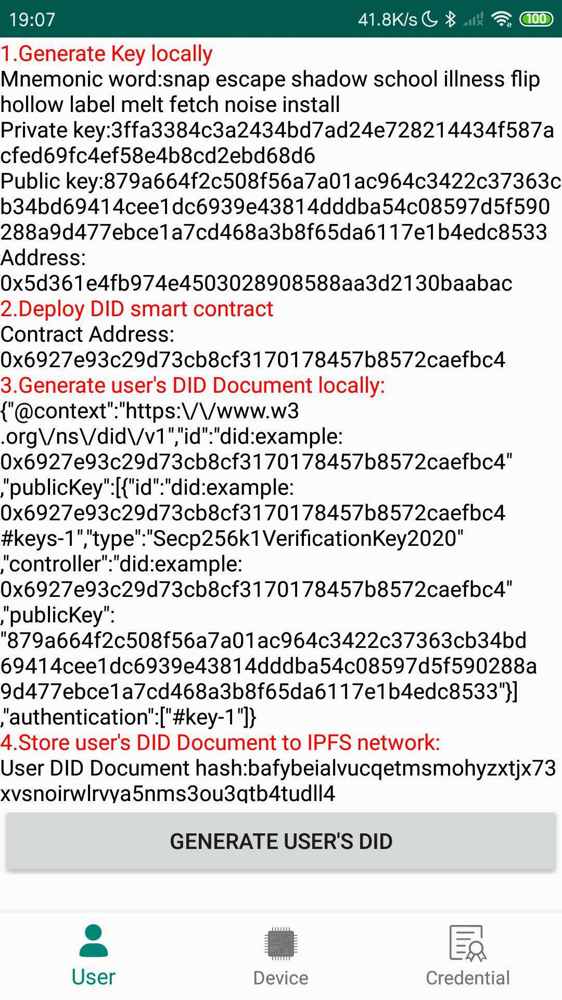
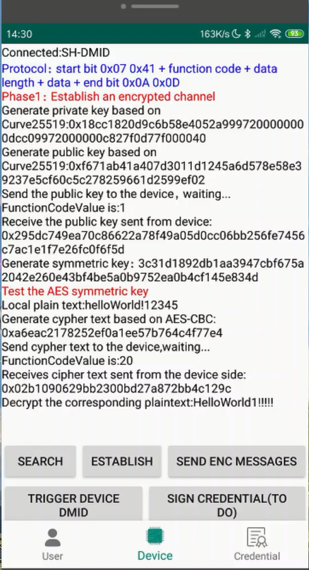
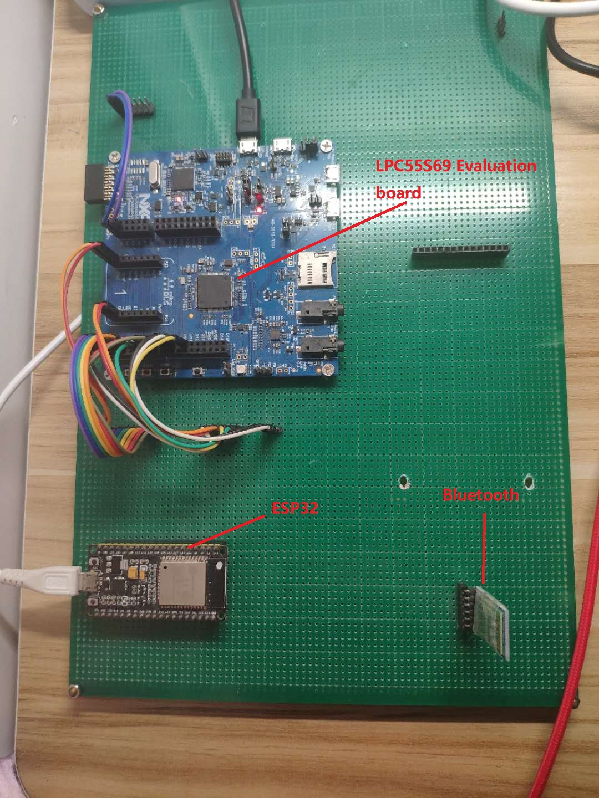

# A-decentralized-IoT-identity-management-system-based-on-blockchain
This project aims at combining ethereum smart contract and IPFS to complete the generation of DID. Users and 
IoT devices will use different contract templates because of different permissions. Users will generate their DIDs through DMID client, at the same time, they will also use the client to trigger their own IoT devices to generate DID.

[Demo Video](https://www.youtube.com/watch?v=lMjFvzWaUok)

**Private chain**
Ethereum geth and puppeth are used to build a private chain, which adpots POA consensus. To make IoT devices use remote IPFS client, Nginx is used.

**DMID Client**
The generation of user's DID contains five parts:
* generate keypairs locally.
* deploy DID contract, the address of contract will be used as DID.
* generate corresponding DID Document based on DID.
* store the DID Document to IPFS network and get IPFS hash.
* modify Document property of contract by IPFS hash.

 
The client will connect to IoT device through bluetooth RFCOMM. Before the client triggers an IoT device to generate DMID, they need to build an encrypted channel. I also design a data transmission protocol like Modbus.

 

**IoT device**
This is a project developed by MCUxpresso (an IDE of NXP company). The main contoller is LPC55S69, as for why I chose it, because it has PUF (physical unclonable function) and trustzone-M architecture, which can be used to secure private key. The private key is vital because it represents the identity of the IoT device. Moreover, to make my design closer to the actual project, I chose ESP32 as my WiFi module, which is a very popular open source IoT hardware. The model of bluetooth is HC05.

This project adopts FreeRTOS. It includes the generation of keypairs, packaging and signing blockchain transaction locally. I also write code about how to configure ESP32 based on serial AT command, and how to construct http package.

 

**Future work**
I have designed the scheme of verified credentials in my [paper](https://dl.acm.org/doi/10.1145/3390566.3391670), the credential also combines smart contract and IPFS. It just like the DID generation, a little repetitive. so if I have free time in the future, I will do it.

